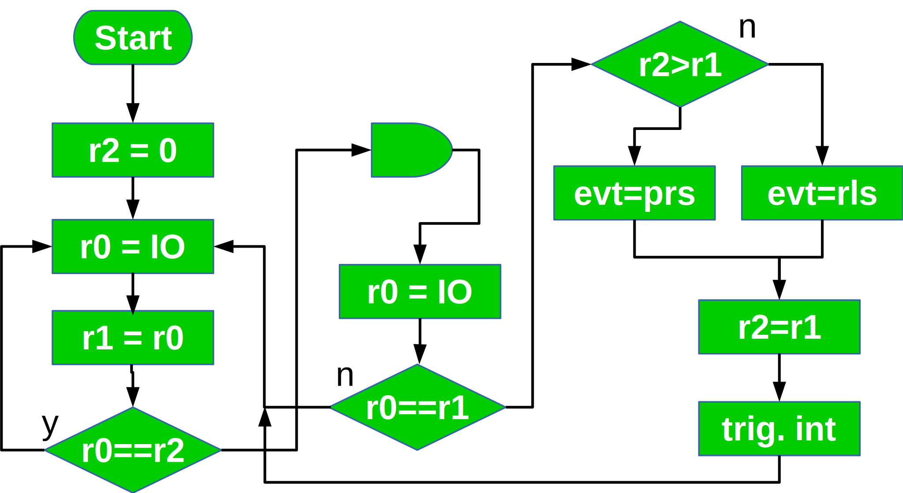

# Example: Switch Debouncing

This code shows how to configure RTC IO and ULP to debounce switches.
A rotatary AB decoder is included aswell 

## RTC IO functions:

|Name|RTC_IO num|GPIO num|wake-up mask|
|:-|:-|:-|:-|
Reed contact|RTC_GPIO00|GPIO36|0x10|
|Rotary B|RTC_GPIO03|GPIO39|0x80|
|Rotary A|RTC_GPIO04|GPIO34|0x04|
|Rotary push|RTC_GPIO05|GPIO35|0x08|
|Push 1|RTC_GPIO08|GPIO33|0x02|

GPIO 34-39 are input only and do not feature pull-up / pull-down
Internal pull-up / pull-down are not used to conserve power during
hibernation.

## Switch Bouncing

ULP register usage

|Name|Description|
|:-|:-|
|r0|temporary|
|r1|current value|
|r2|previous value|
|r3|memory address|

The flow starts after wakeup from hibernation. This happens when 
an IO changes to high. Begore this it must be low. The ULP loops forever
and checks if any IO changed. If this is the case the IO is rechecked after a wait time.

## AB Rotary Encoder Decoding

AB decoders have 4 states 1 to 4. Invalid state transitions have to be ignored

Use a table with 16 entries to determine from AB current and AB previous which transition occured. The table contains 9 for invalid transitions, -1 if the transition indicates counter clockwise rotation and +1 for transistions indicating clockwise rotatation.  
